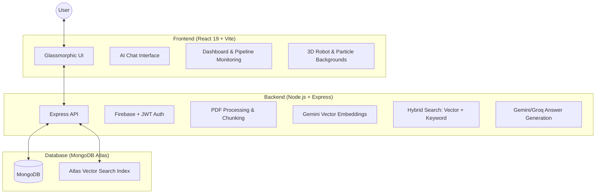

# OpsMind AI — Enterprise Knowledge Agent

> **Revolutionize organizational intelligence with a high-performance RAG-powered SOP assistant.**

OpsMind AI is a full-stack, enterprise-grade AI platform designed to transform static corporate documents (SOPs, manuals, policy guides) into dynamic, interactive knowledge bases. Using **Retrieval-Augmented Generation (RAG)**, it provides zero-hallucination answers with precise citations, all wrapped in a premium, high-fidelity glassmorphic interface.

---

## 🏗 System Architecture

OpsMind AI follows a modern decoupled architecture, ensuring scalability and performance across the entire pipeline.



---

## ✨ Key Features

### 🧠 Intelligent AI Chat
- **RAG-Powered Answers**: Context-aware responses generated only from your uploaded documents.
- **Source Citations**: Real-time message streaming with clickable citations to the exact page and chunk.
- **Dynamic Suggestions**: Document-aware query starters that update based on your library.

### 🛡 Enterprise Security
- **Multi-Layer Auth**: Support for Firebase Google Login and traditional Email/Password (JWT).
- **Role-Based Access (RBAC)**: Distinct permissions for Users and Administrators.
- **Anti-Hallucination**: Similarity threshold gates that prevent the AI from making up answers.

### 📊 Admin Control Center
- **Automated Pipeline**: Drag-and-drop PDF uploads with automated chunking and embedding.
- **Real-Time Monitoring**: Live "Pipeline Status" tracking with background task logs.
- **Advanced Analytics**: Telemetry on query volume, answer rates, and token consumption.

---

## 🛠 Tech Stack

| Component | Technology |
|-----------|------------|
| **Frontend** | React 19, Vite, Tailwind CSS 4, Framer Motion |
| **3D Graphics** | Three.js, React Three Fiber (R3F) |
| **Backend** | Node.js, Express, Socket.io |
| **AI / LLM** | Google Gemini 1.5 Flash (LLM), Gemini text-embedding-004 |
| **Vector DB** | MongoDB Atlas Vector Search |
| **Auth** | Firebase Auth (Google) + Custom JWT |
| **Cache** | Node-Cache (30-min LRU for query optimization) |

---

## 📁 Project Structure

```text
opsmind-ai/
├── frontend/                # React 19 Frontend Application
│   ├── src/
│   │   ├── components/      # admin, chat, auth, three, ui
│   │   ├── context/         # Auth, Admin, Theme, Notification
│   │   ├── hooks/           # useChat, useAdmin, useAuth, useDocuments
│   │   ├── pages/           # AdminPage, ChatPage, AuthPage
│   │   └── utils/           # api, firebase, streamParser
│   └── public/              # Static assets and 3D models
│
├── backend/                 # Node.js Express Backend
│   ├── src/
│   │   ├── controllers/     # document, admin, auth, chat, query
│   │   ├── middlewares/     # auth, error, validation
│   │   ├── models/          # Document, Chunk, User, Analytics, Chat
│   │   ├── services/        # embedding, pdf, retrieval, llm, socket
│   │   └── utils/           # logger, apiResponse, sanitizer, cache
│   └── scripts/             # setup (index creation), seed (admin creation)
│
└── uploads/                 # Storage for processed PDF documents
```

---

## 🚀 Quick Start

### 1. Prerequisites
- **Node.js**: v18.x+
- **MongoDB Atlas**: Account and Cluster (M0+ supported)
- **API Keys**: Google Gemini (AI Studio) and Firebase

### 2. Backend Setup
```bash
cd backend
cp .env.example .env
# Fill in MONGODB_URI, JWT_SECRET, GEMINI_API_KEY
npm install
npm run setup   # Creates Atlas Vector Search indexes
npm run dev     # Starts at http://localhost:5000
```

### 3. Frontend Setup
```bash
cd frontend
cp .env.example .env
# Fill in Firebase credentials (VITE_FIREBASE_*)
npm install
npm run dev     # Starts at http://localhost:5173
```

---

## 📖 Detailed Documentation

For more specific details on the implementation of each layer, please refer to the internal READMEs:

- [Frontend Documentation](file:///c:/Users/rajat/OneDrive/Desktop/Coding/Empty/internship/projects/ApsMind_AI/opsmind-ai/frontend/README.md)
- [Backend Documentation](file:///c:/Users/rajat/OneDrive/Desktop/Coding/Empty/internship/projects/ApsMind_AI/opsmind-ai/backend/README.md)

---

## 🔒 License
Built by **Antigravity** for OpsMind AI. Standard Enterprise License.